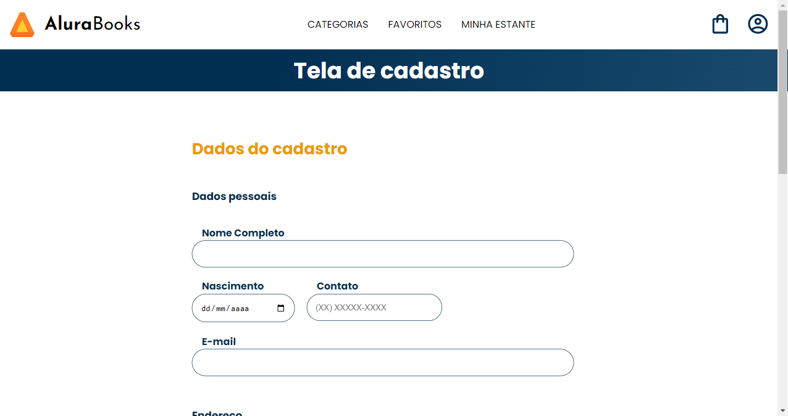

# Formulário do AluraBooks

> Formulário do AluraBooks

Projeto construído durante o curso JavaScript: consumindo e tratando dados de uma API, ministrado pela Alura.

[Clique aqui para acessar](https://aluratube-ten-drab.vercel.app/)

## Tecnologias

- JavaScript
- HTML e CSS

## 💻 Projeto

O Formulário do AluraBooks é a página de formulários do AluraBooks. A página foi desenvolvida usando HTML, CSS e JavaScript. Logo estarei únindo a página ao projeto inicial da HomePage do AluraBooks.
